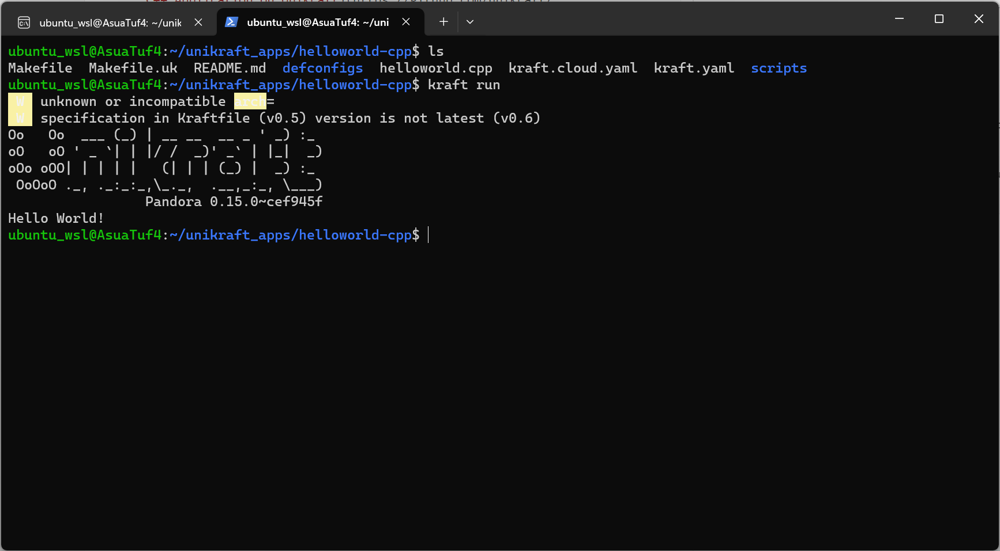
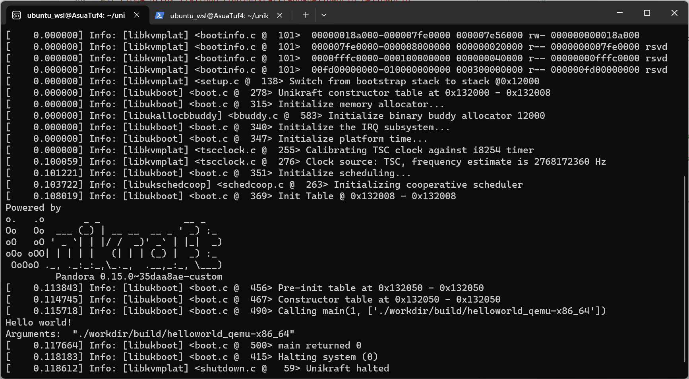
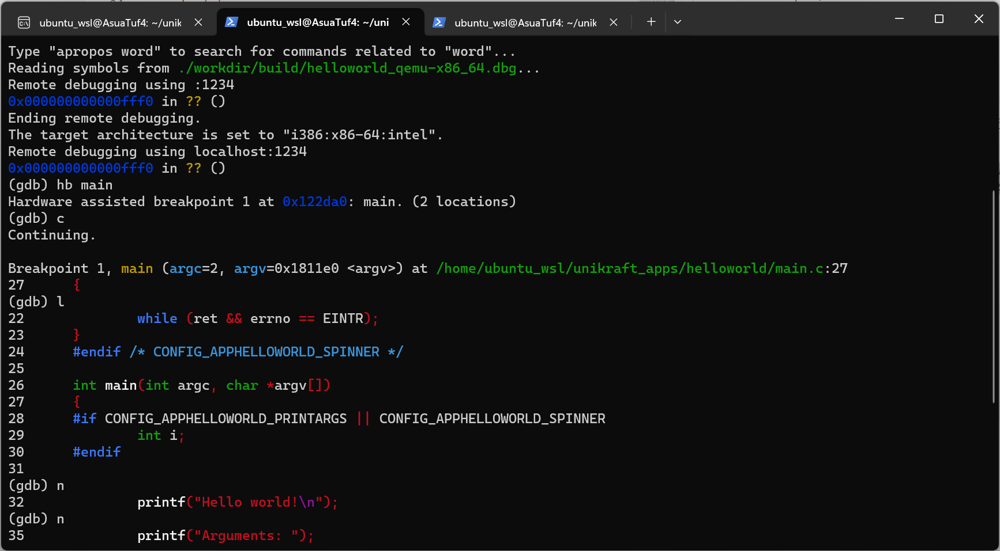

# Unikraft 构建、运行和调试helloworld应用

## Quickly Start

使用kraft命令启动一个helloworld应用举例，参考了 [A "Hello, world!" C++ Application on Unikraft](https://github.com/unikraft/app-helloworld-cpp)

```shell
# 安装kraft
curl --proto '=https' --tlsv1.2 -sSf https://get.kraftkit.sh | sh
# 下载helloworld应用
git clone https://github.com/unikraft/app-helloworld-cpp helloworld-cpp
# build and run
cd helloworld-cpp/
kraft build --arch x86_64 --plat qemu
kraft run
```



## 使用makefile工具构建和运行

参考了 [Baby Steps - Unikraft Internals](https://unikraft.org/guides/internals)

安装需要的包：

```shell
sudo apt install -y --no-install-recommends \
  build-essential \
  sudo \
  gcc-aarch64-linux-gnu \
  libncurses-dev \
  libyaml-dev \
  flex \
  bison \
  git \
  wget \
  uuid-runtime \
  qemu-kvm \
  qemu-system-x86 \
  qemu-system-arm \
  sgabios
```

下载代码

```shell
# 下载helloworld应用代码
git clone https://github.com/unikraft/app-helloworld helloworld
cd helloworld/
# 下载unikraft
mkdir workdir/
cd workdir/
git clone https://github.com/unikraft/unikraft unikraft
mkdir libs
cd ../
```

配置和运行helloworld应用

```shell
make menuconfig
# choose "Architecture Selection/Architecture/X86 compatible"
# choose "Platform Configuration/X86 compatible"
# choose "Library Configuration/ukdebug/kernel message/Show all types of messages" open kernel message
make -j$(nproc)
# run
qemu-system-x86_64 -kernel ./workdir/build/helloworld_qemu-x86_64 -nographic
```



## 使用GDB调试Unikraft

参考 [Debugging](https://unikraft.org/guides/debugging)

在使用GDB开始debug之前，注意config（make menuconfig）的几个选项

1. "Build Options/Drop unused functions and data" is unselected
2. "Build Options/Debug information level/level 3" is selected

重新构建:

```shell
make properclean
make -j$(nproc)
```

打开一个终端窗口，运行：

```shell
path_to_kernel=./workdir/build/helloworld_qemu-x86_64
qemu-system-x86_64 -s \
-S \
-cpu host \
-enable-kvm -m 128 \
-no-acpi \
-display none \
-nographic \
-device isa-debug-exit \
-kernel $path_to_kernel \
-append verbose
```

新建一个终端窗口，切换到之前的应用目录，运行：

```shell
path_to_kernel=./workdir/build/helloworld_qemu-x86_64
gdb --eval-command="target remote :1234" ${path_to_kernel}.dbg \
-ex "disconnect" \
-ex "set arch i386:x86-64:intel" \
-ex "tar remote localhost:1234"
```

在GDB中设置断点：

```GDB
# 在main函数入口处设置断点
hb main
c
l
n
```


