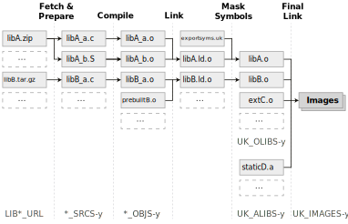
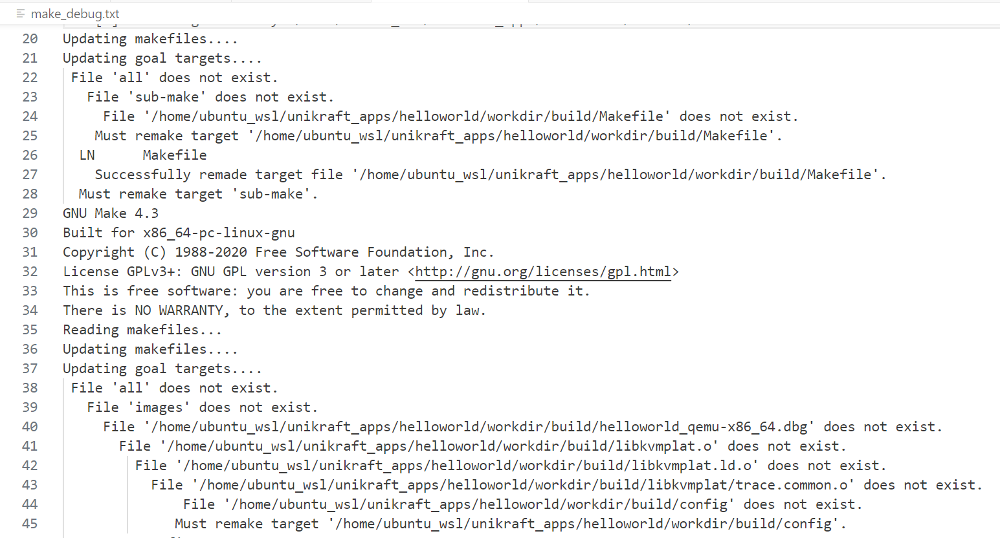
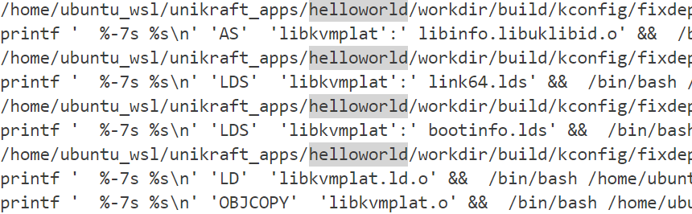

# 从make到main

在[上一节](./1.Unikraft构建、运行和调试helloworld应用.md)里介绍了使用unikraft运行一个简单的helloworld应用的方式，本文分析unikraft编译和boot的过程，粗略地梳理从make编译到使用qemu运行helloworld程序这一过程中发生了什么。

## Unikraft构建过程简介

参考[Build Process](https://unikraft.org/docs/internals/build-process)和[Build Process-Internals](https://unikraft.org/docs/internals/build-system)。

构建一个Unikraft unikernel的生命周期包括以下的步骤:

1. 配置具有编译时选项的Unikraft Unikernel应用程序
2. 获取和准备外部库的源代码
3. 编译库和Unikraft核心代码
4. 链接最终的Unikernel映像

构建过程如下图所示：




Unikraft的构建系统需要应用提供这样一些文件：

1. Makefile:用于指定主Unikraft代码库相对于应用程序的代码的位置，以及应用程序需要使用的任何外部库的存储库。
2. Makefile.uk:用于指定要构建的源代码(以及可选地从哪里获取它们)，包括路径、标志和任何特定于应用程序的目标。
3. Config.uk:一个类似kconfig的代码片段，用于用特定于应用程序的选项填充Unikraft的菜单(在`make menuconfig`中的可选字段)。
4. exportsyms.uk:一个文本文件，其中每行包含一个应该导出到其他库的符号的名称。
5. extra.ld:可选的，包含对主链接器脚本的修改。

配置的方式为在`Config.uk`中添加依赖项，然后通过`make menuconfig`生成`.config`文件。最后链接到镜像中。或者修改`kraft.yaml`然后运行`kraft configure`。

## 分析Makefile debug信息

通过分析Unikraft的make编译时的debug信息可以更好地理解Unikraft的编译镜像的过程。

**<big>使用`make --debug=b`打印基本的makefile调试信息。</big>**

**<big>使用`make -n`打印将要执行的命令，但是并不执行它们。</big>**

**<big>使用`make V=1`查看在构建过程中执行的命令。（Unikraft自带）</big>**

这里，将`make --debug=b`的输出重定向到`make_debug.txt`，将`make -n`的输出重定向到`make_cmd.txt`。

`make_debug.txt`的部分截图：



从makefile的debug信息中，可以观察到make的目标构建顺序：

```text
|--> all(./) 
    |
    |--> all(./workdir/unikraft) --> sub-make 
        |
        |--> all(./workdir/build) --> |
                                      | --> images 
                                      | --> gdb_helpers
```

在`./workdir/build`目录下执行的makefile文件是`./workdir/unikraft`目录下makefile文件的符号链接。

在sub-make后执行的命令为

```makefile
sub-make: $(BUILD_DIR)/Makefile
    $(Q)$(MAKE) --no-print-directory CONFIG_UK_BASE=$(CONFIG_UK_BASE) -C $(BUILD_DIR) -f $(BUILD_DIR)/Makefile $(MAKECMDGOALS)
```

这里设置了`CONFIG_UK_BASE`参数，即Unikraft的配置文件路径，之后再进入这个makefile，会将命令冲定位到以下部分：

```text
all: images gdb_helpers
```

images为需要构建的镜像文件,变量`UK_DEBUG_IMAGES`等在makefile参数`CONFIG_UK_BASE`被设置时生成（暂时不清楚生成代码）：

```text
images: $(UK_DEBUG_IMAGES) $(UK_DEBUG_IMAGES-y) $(UK_IMAGES) $(UK_IMAGES-y)
```

可以观察make_debug.txt或者手动打印变量来确认`UK_DEBUG_IMAGES`和`UKIMAGES`的值，在这里：

```text
UK_DEBUG_IMAGES = {your_path}/workdir/build/helloworld_qemu-x86_64.dbg
UK_IMAGES = {your_path}/workdir/build/helloworld_qemu-x86_64 {your_path}/workdir/build/helloworld_qemu-x86_64.gz
```

接着通过观察`make_cmd.txt`确定helloworld_qemu-x86_64.dbg是如何通过编译和链接形成的。找到这条命令：

```text
printf '  %-7s %s\n' 'LD'  'helloworld_qemu-x86_64.dbg' &&  \
/bin/bash \
/home/ubuntu_wsl/unikraft_apps/helloworld/workdir/build/    \   helloworld_qemu-x86_64.dbg.cmd
```

它告诉我们`helloworld_qemu-x86_64.dbg`的生成方式，在相应的目录下找到`helloworld_qemu-x86_64.dbg.cmd`这个文件(我使用的是WSL，在原生的linux环境中可能不太一样)。发现它执行了这样一条gcc链接命令：

```
""gcc -Wl,-m,elf_x86_64 -Wl,--entry=_multiboot_entry /home/ubuntu_wsl/unikraft_apps/helloworld/workdir/build/libkvmplat.o /home/ubuntu_wsl/unikraft_apps/helloworld/workdir/build/apphelloworld.o /home/ubuntu_wsl/unikraft_apps/helloworld/workdir/build/libnolibc.o /home/ubuntu_wsl/unikraft_apps/helloworld/workdir/build/libukalloc.o /home/ubuntu_wsl/unikraft_apps/helloworld/workdir/build/libukallocbbuddy.o /home/ubuntu_wsl/unikraft_apps/helloworld/workdir/build/libukargparse.o /home/ubuntu_wsl/unikraft_apps/helloworld/workdir/build/libukboot.o /home/ubuntu_wsl/unikraft_apps/helloworld/workdir/build/libukboot_main.o /home/ubuntu_wsl/unikraft_apps/helloworld/workdir/build/libukdebug.o /home/ubuntu_wsl/unikraft_apps/helloworld/workdir/build/libuklibid.o /home/ubuntu_wsl/unikraft_apps/helloworld/workdir/build/libukintctlr.o /home/ubuntu_wsl/unikraft_apps/helloworld/workdir/build/libuksched.o /home/ubuntu_wsl/unikraft_apps/helloworld/workdir/build/libukschedcoop.o /home/ubuntu_wsl/unikraft_apps/helloworld/workdir/build/libuktimeconv.o /home/ubuntu_wsl/unikraft_apps/helloworld/workdir/build/libcontext.o /home/ubuntu_wsl/unikraft_apps/helloworld/workdir/build/libukintctlr_xpic.o -Wl,--start-group -Wl,--end-group -nostdlib -Wl,--build-id=none -nostdinc -no-pie -Wl,-dT,/home/ubuntu_wsl/unikraft_apps/helloworld/workdir/build/libkvmplat/link64.lds -Wl,-T,/home/ubuntu_wsl/unikraft_apps/helloworld/workdir/build/libkvmplat/bootinfo.lds -Wl,-T,/home/ubuntu_wsl/unikraft_apps/helloworld/workdir/unikraft/lib/uklibid/infosec.ld -Wl,-T,/home/ubuntu_wsl/unikraft_apps/helloworld/workdir/unikraft/lib/uksched/extra.ld -o /home/ubuntu_wsl/unikraft_apps/helloworld/workdir/build/helloworld_qemu-x86_64.dbg
```

它把helloworld应用代码文件生成的目标`apphelloworld.o`和Unikraft内部库生成的目标文件`libxxx.o`通过一些列链接脚本(`link64.lds`、`bootinfo.lds`、`infosec.ld`和`extra.ld`)链接起来，并设置程序**入口地址**为`_multiboot_entry`。

在这些中间生成物中，我们重点关注的是`libkvmplat`，它是系统用于kvm平台boot的那部分代码的生成物。

同样地找到生成libkvmplat.o的编译命令:



它由`link64.lds`、`bootinfo.lds`和一些列目标文件链接而成。这部分代码位于`./workdir/unikraft/plat/kvm/x86`中，`link64.lds.S`规定了镜像在内存中的布局，`multiboot.S`文件中定义了镜像的入口地址`_multiboot_entry`。

然而`_multiboot_entry`处的指令依然不是执行的第一条指令，使用`disas/r 0x122d6e,+8`可以看到`_multiboot_entry`处的指令，而设置qemu打印日志`-D ./qemu.log -d in_asm`选项生成的日志中第一条指定的位置为0xfffffff0处的ea5be000f0。

## 从boot到main的执行流

使用GDB调试，顺藤摸瓜找到从mutiboot.S到main.c的执行流，注：`hb`设置硬件断点，`c`程序继续运行，`n 1`单步执行：

```text
|--> _multiboot_entry(./workdir/unikraft/plat/kvm/x86/multiboot.S)
|
|--> lcpu_start32 -> lcpu_start64(./workdir/unikraft/plat/kvm/x86/lcpu_start.S)
|
|--> multiboot_entry(./workdir/unikraft/plat/kvm/x86/multiboot.c)
|
|--> _ukplat_entry -> _ukplat_entry2(./workdir/unikraft/plat/kvm/x86/setup.c)
|
|--> ukplat_entry_argp -> ukplat_entry -> do_main(./workdir/unikraft/lib/ukboot/boot.c)
|
|--> main.c(./main.c)
```
