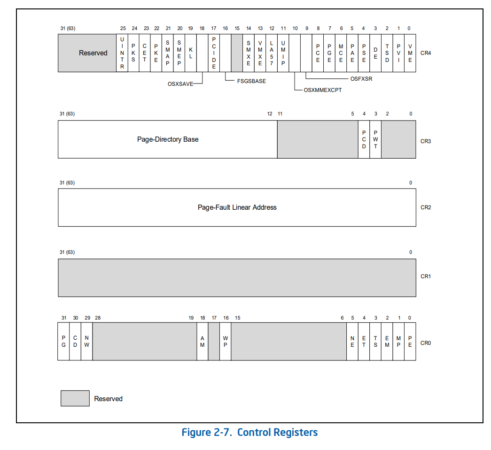
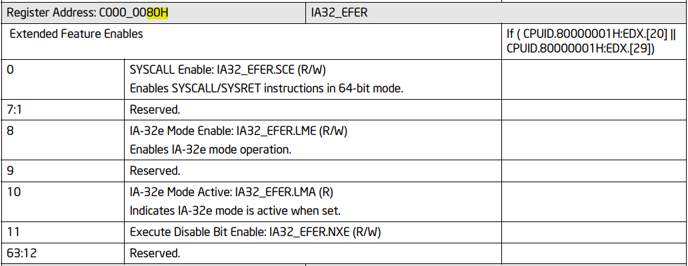
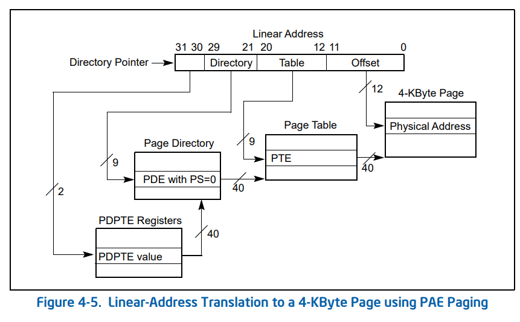
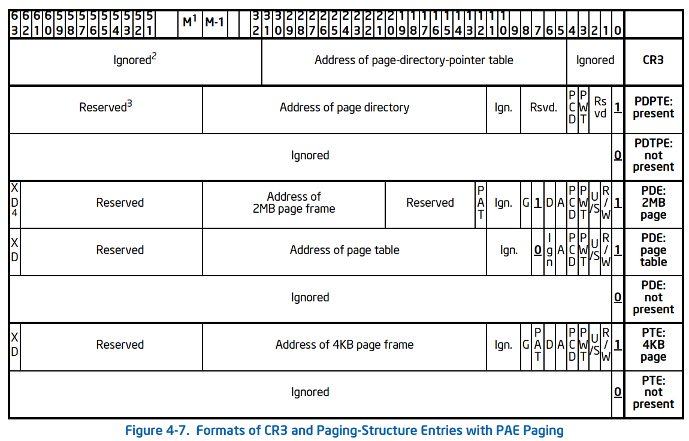
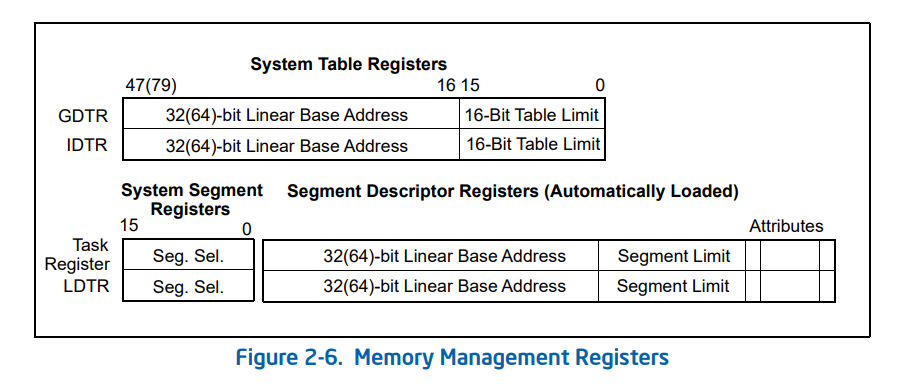
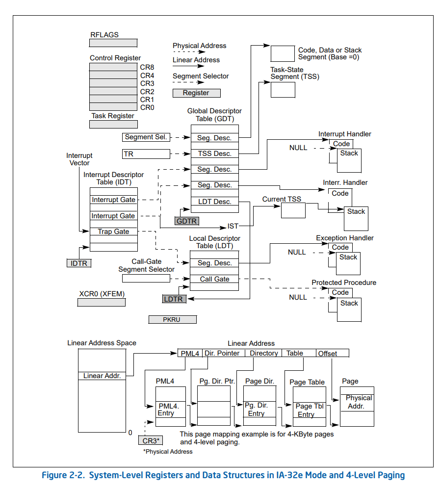
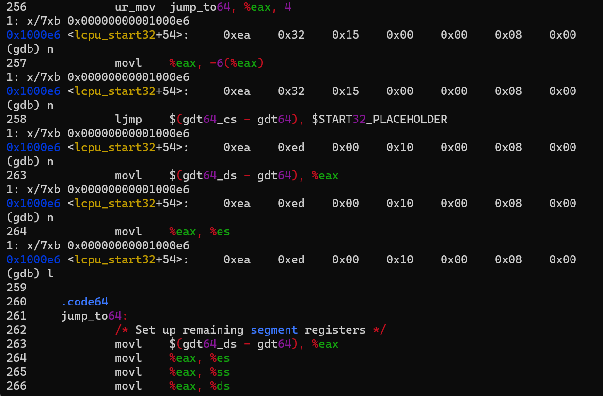

# Unikraft启动代码解析——汇编部分

## 代码阅读小技巧

1. 阅读启动部分的汇编代码，需要对X86架构下的汇编有一定的了解。这里，我推荐阅读MIT 6.s081课程的[X86汇编Guild](http://6.s081.scripts.mit.edu/sp18/x86-64-architecture-guide.html)和[x86-64 Assembly Language Programming with Ubuntu](http://www.egr.unlv.edu/~ed/assembly64.pdf)快速入门。此外需要注意Unikraft使用的汇编语法是[AT&T语法](https://en.wikipedia.org/wiki/X86_assembly_language)，而AT&T语法的指令与Intel语法的指令有较大出入（AT&T语法汇编貌似找不到参考文档），但是指令的操作码是一样的，遇到不确定的指令可以直接根据指令的操作码进行判别，参考[这里](https://cloud.tencent.com/developer/article/1623089)。对于Intel X86指令的功能，可以在[这个网站](https://www.felixcloutier.com/x86/)快速查找。

2. 充分利用文档。

    在汇编代码和链接脚本中大量地使用了汇编器和链接器的指令(Directives)，阅读这部分指令，需要查找[GNU as文档和GNU ld文档](https://sourceware.org/binutils/docs-2.41/)。对于X86架构的各个寄存器的用法、分段、分页等特性，需要查看Intel的发开手册[Intel® 64 and IA-32 Architectures Software Developer Manuals](https://www.intel.com/content/www/us/en/developer/articles/technical/intel-sdm.html)，Intel的发开手册大概有5000页，只适合按需查阅。

3. 善于使用查找

    在代码阅读中，如果遇到从来没见过的符号、变量或宏，使用查找几乎可以解决所有问题。在VS code中在当前目录下的文件中查找符号使用快捷键`Ctrl+Shift+L`(注意设置`Search: Use Ignore Files`为`false`禁用忽略.gitignore包含的文件)。使用`find`命令或者使用VS code正上方的搜索栏可以快速查找文件。在VS code打开的文件中使用`Ctrl+F`在文件中搜索符号。在浏览器中阅读PDF文档时也可以使用`Ctrl+F`查找关键字定位想要的内容。

4. 使用GDB调试，如果遇到不理解的代码段或者跳转，建议使用GDB单步调试。

5. 使用搜索引擎和大模型

    使用搜索引擎和大模型可以极大地提升效率，比如说可以向new bing和chatgpt提交代码段和命令，让其给出大概的分析，然后有目的地查找相关的文档，这比漫无目的地使用搜索引擎和查找文档要高效。

## multiboot.S

在上个小节中，我们通过分析make的debug信息找到了Unikraft镜像的入口地址`_multiboot_entry`,它位于文件multiboot.S中。接着使用GDB调试得到从`_multiboot_entry`到`main.c`中的`main`函数的执行流程：

```text
|--> _multiboot_entry(./workdir/unikraft/plat/kvm/x86/multiboot.S)
|
|--> lcpu_start32 -> lcpu_start64(./workdir/unikraft/plat/kvm/x86/lcpu_start.S)
|
|--> multiboot_entry(./workdir/unikraft/plat/kvm/x86/multiboot.c)
|
|--> _ukplat_entry -> _ukplat_entry2(./workdir/unikraft/plat/kvm/x86/setup.c)
|
|--> ukplat_entry_argp -> ukplat_entry -> do_main(./workdir/unikraft/lib/ukboot/boot.c)
|
|--> main.c(./main.c)
```

顺着这条路径，阅读Unikraft的启动代码。首先是`_multiboot_entry`，它是镜像文件`helloworld_qemu-x86_64`的入口地址，但不是第一条执行的指令，在此之前，qemu启动[SeaBIOS](https://www.seabios.org/SeaBIOS)，从BIOS到`_multiboot_entry`入口地址，已经执行了全流程的大概2/3左右的指令(观察qemu.log日志)。在到达`_multiboot_entry`时，BIOS已经完成了一部分初始化工作：

1. 寄存器`EAX`存放了[魔数](https://en.wikipedia.org/wiki/Magic_number_(programming))的值
2. 寄存器`EBX`存放了mutilboot信息
3. 设置了当前的基本执行环境：处于保护模式（CPU最初的状态），使用连续的4GB线性地址（启用[A20 gate](https://en.wikipedia.org/wiki/A20_line)），关闭了分页和中断，初始化了CS、DS等段寄存器的值。关于X86的操作模式和内存模式，见Intel开发手册卷1第三章。

`_multiboot_entry` Section的代码如下，这段代码的只要功能是判断魔数是否对应multiboot然后准备参数并跳转到lcpu_start.S文件中的`lcpu_start32`。

```C
.code32
.section .text.32.boot
ENTRY(_multiboot_entry)
    /* only multiboot is supported for now */
    cmpl	$MULTIBOOT_BOOTLOADER_MAGIC, %eax // 判断魔数是否对应multiboot
    jne	no_multiboot

    /* Hardcoding for now I guess... */
    movl    $0x00100000, %edi
    movl    $0x00000000, %esi
    movl    $0x00100000, %edx
    // 需要配置CONFIG_LIBUKRELOC才执行do_uk_reloc32宏
    do_uk_reloc32   0   

    /* startup args for boot CPU */
    // 在没有配置CONFIG_LIBUKRELOC时相仅当于 mov cpu_boot_startup_args, %edi
    ur_mov  lcpu_boot_startup_args, %edi, 4, _phys  
    movl	%ebx, %esi			/* multiboot info */

    ur_mov	lcpu_start32, %ebx, 4, _phys
    jmp     *%ebx

no_multiboot:
    // 清除中断标志位
    cli
1:
    // 终止CPU执行
    hlt
    jmp	1b
END(_multiboot_entry)
```

其中寄存器`edi`中存放了两个参数：分别时CPU初始化时的栈指针和一个入口函数指针，符号`multiboot_entry`指向`multiboot.c`文件中的入口函数。

```C
/**
 * Stack and entry function to use during CPU initialization
 */
.section .bss
.space 4096
lcpu_bootstack:

.section .rodata
lcpu_boot_startup_args:
    /*在没有配置CONFIG_LIBUKRELOC时，
    ur_data	quad, multiboot_entry, 8 等效于：
    quad, multiboot_entry*/

	ur_data	quad, multiboot_entry, 8
	ur_data	quad, lcpu_bootstack, 8
```

如果CONFIG_LIBUKRELOC被设置，将会在.uk_reloc section中加入一些条目(entry)，条目的格式如下，需要配合ur_sym使用生成一个uk_reloc符号：

```C
struct uk_reloc {
    /* Offset relative to runtime base address where to apply relocation */
    __u64 r_mem_off;
    /* Relative address value of the relocation */
    __u64 r_addr;
    /* Size of the relocation */
    __u32 r_sz;
    /* Relocation flags to change relocator behavior for this entry */
    __u32 flags;
} __packed;
```

由于do_uk_reloc32的代码比较复杂，还没有完全弄清，此外do_uk_reloc32在没有设置CONFIG_LIBUKRELOC也不会使用。

## lcpu_start32(lcpu_start.S)

lcpu_start.S中的代码主要用于初始化引导CPU的状态，然后跳转到之前传递的参数中的`multiboot_entry`地址。

CPU经过了`_multiboot_entry`，然后跳转到32位过度代码片段`lcpu_start32`，它的主要作用为：

1. 开启PAE拓展并设置页表基地址
2. 启用64位模式(IA32-e)
3. 载入全局符号描述表（GDT）
4. 跳转带64位的CPU初始化lcpu_start64

```C
.code32
.section .text.boot.32
ENTRY(lcpu_start32)
	/* Enable physical address extension (PAE) */
	movl	$CR4_BOOT32_SETTINGS, %eax
	movl	%eax, %cr4  // 将cr4的第5位设置为1开启PAE以支持超过4GB内存空间

	/* Switch to IA-32e mode (long mode) */
	xorl	%edx, %edx  // edx = 0x0
	movl	$EFER_BOOT32_SETTINGS, %eax // eax = 1 << 8
	movl	$X86_MSR_EFER, %ecx // ecx = 0xC000_0080H
	wrmsr   // 将 edx:eax 写入到由ecx指定的64位MSR寄存器中

	/* Set boot page table and enable paging */
	ur_mov	x86_bpt_pml4, %eax, 4, _phys
	movl	%eax, %cr3  // 在开启PAE模式下，对cr3的mov指令会自动地将页表基地址写入到cr3相应的位置

	movl	$CR0_BOOT32_SETTINGS, %eax
	movl	%eax, %cr0

	/* Load 64-bit GDT and jump to 64-bit code segment */
	ur_mov	gdt64_ptr, %eax, 4
	lgdt	(%eax)

	/* Again, we use the same strategy, only this time we generate an actual
	 * uk_reloc entry to be automatically resolved by the early relocator,
	 * instead of relying on the code that relocates the start16 section
	 * before starting the Application Processors, since execution of
	 * lcpu_start32 comes before that.
	 */
	ur_mov	jump_to64, %eax, 4
	movl	%eax, -6(%eax)
	ljmp	$(gdt64_cs - gdt64), $START32_PLACEHOLDER

.code64
jump_to64:
	/* Set up remaining segment registers */
	movl	$(gdt64_ds - gdt64), %eax
	movl	%eax, %es
	movl	%eax, %ss
	movl	%eax, %ds

	xorl	%eax, %eax
	movl	%eax, %fs
	movl	%eax, %gs

	leaq	lcpu_start64(%rip), %rcx
	jmp	*%rcx
END(lcpu_start32)
```

### 补充说明

这里涉及到X86(IA32)架构的控制寄存器（CONTROL REGISTERS）读写，控制寄存器决定了处理器的执行模式和当前任务的执行特征，详见Intel的发开手册，第3卷（4卷）第2.5节。

1. CR0控制处理器的操作模式和状态
2. CR1预留
3. CR2保存了缺页的线性地址
4. CR3保存了页表基地址和相关控制位
5. CR4用于控制一些额外特性如：SSE、AVX的启用
6. CR8提供了对Task Priority Register (TPR)的读写，只能用在64位模式(IA-32e)下。



### 开启PAE和启用64位模式

上述代码中，开启PAE的作用是将物理地址空间拓展到大于4GB，在PAE中，仍然使用32位的线性地址，然是PAE将32位线性地址映射为52位的物理地址(4PB)，但是在单一时刻，进程最多只能看到4GB的地址空间，需要切换CR3中页表才能看到其他的内存空间，[参考](https://stackoverflow.com/questions/8373944/how-does-pae-physical-address-extension-enable-an-address-space-larger-than-4g)。开启PAE，只需要设置CR4的第5位为1即可。接着向地址为0xC000_0080H的寄存器的第8位置为1以开启IA-32e（64位）模式。MSR寄存器的字段可以查找Intel开发手册第4卷第4章找到，这里地址为0xC000_0080H的MSR寄存器的标志位如下图：



### 页表结构和启用分页

上述代码将符号`x86_bpt_pml4`的地址移入CR3寄存器中。而在PAE模式下配有三级页表，分别是页目录指针表（Page Dirctory Pointer Table,PDPT）、页目录（Page Directory,PD）和页表（Page Table, PT），线性地址的到物理地址的转换过程如下图所示（关于PAE参考Intel开发手册卷3第4.4小节）：



CR3和各级页表的表项如下图所示：



32位线性地址的最高两位用于指定PDPTE Register的位置，PAE开启后，处理器持有四个PDPTE Register，在启用4kb的页表时，每个寄存器存放一个PDPTE用于控制1G大小的线性地址的访问。页目录的每个页目录项控制2M的地址空间访问，每个页表项控制4kb的访问。

我们可以在文件`pagetable64.S`中找到页表结构的定义，其中pte和各级页表的表项pte_page的宏定义如下：

```C
/**
 * Outputs a single page table entry
 *
 * @param paddr physical address for PTE
 * @param pte additional flags for PTE
 */
.macro pte paddr, pte
    .quad \paddr + \pte // 物理地址4k对齐，pte的低12位用于设置标志位
.endm

/**
 * Outputs a single page table entry that automatically contains the large/huge
 * page flag depending on the page table level
 *
 * @param paddr physical address for PTE
 * @param level level of the page table the PTE is intended for
 * @param pte additional flags for PTE
 */
.macro pte_page paddr, level, pte
// X86_PTE_PSE = 0x80, 作用时将PTE的第7位PS置为1，表示索引到的是页表
.ifeq (\level - PAGE_HUGE_LEVEL)
	pte \paddr, (\pte + X86_PTE_PSE)
	.exitm
.endif
.ifeq (\level - PAGE_LARGE_LEVEL)
	pte \paddr, (\pte + X86_PTE_PSE)
.else
	pte \paddr, \pte
.endif
.endm
```

pte_fill用于从某个地址开始填充一系列页表项。pte_zero把一个页表项填充为0.

```C
/**
 * Outputs a number of page table entries for a continuous mapping starting at
 * the provided physical address. Page size is chosen according to level.
 *
 * @param paddr physical address of the beginning of the area to map
 * @param pages number of pages to map
 * @param level level of the page table the PTEs are intended for
 * @param pte additional flags for PTE
 */
.macro pte_fill paddr, pages, lvl, pte
.ifle \pages
	.exitm
.endif
	pte_page (\paddr + PAGE_Lx_SIZE(\lvl) * 0), \lvl, \pte
.ifgt \pages - 8
	/* Have to do some unrolling to not exceed max nested macros */
	pte_page (\paddr + PAGE_Lx_SIZE(\lvl) * 1), \lvl, \pte
	pte_page (\paddr + PAGE_Lx_SIZE(\lvl) * 2), \lvl, \pte
	pte_page (\paddr + PAGE_Lx_SIZE(\lvl) * 3), \lvl, \pte
	pte_page (\paddr + PAGE_Lx_SIZE(\lvl) * 4), \lvl, \pte
	pte_page (\paddr + PAGE_Lx_SIZE(\lvl) * 5), \lvl, \pte
	pte_page (\paddr + PAGE_Lx_SIZE(\lvl) * 6), \lvl, \pte
	pte_page (\paddr + PAGE_Lx_SIZE(\lvl) * 7), \lvl, \pte
	pte_fill (\paddr + PAGE_Lx_SIZE(\lvl) * 8), (\pages - 8), \lvl, \pte
.else
	pte_fill (\paddr + PAGE_Lx_SIZE(\lvl) * 1), (\pages - 1), \lvl, \pte
.endif
.endm

/**
 * Outputs a number of non-present page table entries
 *
 * @param paddr physical address (not used)
 * @param pages number of PTEs
 */
.macro pte_zero paddr=0, pages
	.fill \pages, 0x8, 0
.endm
```

接着定义了1G大小的地址空间，其中第一个页面是不可用的：

```C
.align 0x1000
x86_bpt_pt0_0_0: /* 4K pages */
	pte_zero 0x0000000000000000, 0x001
	pte_fill 0x0000000000001000, 0x1ff, PT_LVL, PTE_RW

.align 0x1000
x86_bpt_pd0_0: /* 2M pages */
	ur_pte x86_bpt_pt0_0_0, PTE_RW
	pte_fill 0x0000000000200000, 0x1ff, PD_LVL, PTE_RW

x86_bpt_pd0_1: /* 2M pages */
	pte_fill 0x0000000040000000, 0x200, PD_LVL, PTE_RW

x86_bpt_pd0_2: /* 2M pages */
	pte_fill 0x0000000080000000, 0x200, PD_LVL, PTE_RW

x86_bpt_pd0_3: /* 2M pages */
	pte_fill 0x00000000c0000000, 0x200, PD_LVL, PTE_RW

.align 0x1000
x86_bpt_pdpt0: /* 1G pages */
	ur_pte	x86_bpt_pd0_0, PTE_RW
	ur_pte	x86_bpt_pd0_1, PTE_RW
	ur_pte	x86_bpt_pd0_2, PTE_RW
	ur_pte	x86_bpt_pd0_3, PTE_RW
	pte_zero , 0x1fc
```

同时用一个结构表示可用的地址空间，大小为4G，用于后续分配，这样在没有配置paging（在menuconfig中配置）的情况下，映射了0x0000000000000000 - 0x00000000ffffffff的4G内存，但是只有前1G是在PDPT中分配了页表项的

```C
.align 4
.global bpt_unmap_mrd
bpt_unmap_mrd:
	.quad	0x0000000000000000		/* 0 GiB */
	.quad	0x0000000000000000		/* 0 GiB */
	.quad	0x0000000100000000		/* 4 GiB */
	.short	0x0000000000000000
	.short	0x0000000000000010		/* UKPLAT_MEMRF_UNMAP */
	.fill	36, 1, 0

// 对饮的结构体定义如下，在文件memory.h中
/**
 * Descriptor of a memory region
 */
struct ukplat_memregion_desc {
	/** Physical base address */
	__paddr_t pbase;
	/** Virtual base address */
	__vaddr_t vbase;
	/** Length in bytes */
	__sz len;
	/** Memory region type (see UKPLAT_MEMRT_*) */
	__u16 type;
	/** Memory region flags (see UKPLAT_MEMRF_*) */
	__u16 flags;
#ifdef CONFIG_UKPLAT_MEMRNAME
	/** Region name */
	char name[36];
#endif /* CONFIG_UKPLAT_MEMRNAME */
} __packed __align(__SIZEOF_LONG__);
```

最后需要将CR0中的PG和PE标记为1才能启用PAE,此外这条指令还设置了WP标志位用于阻止OS程序写入只读的页面，

```C
#define CR0_BOOT32_SETTINGS						\
	  X86_CR0_PE	/* Protected mode */				\
	| X86_CR0_WP	/* Write Protect */				\
	| X86_CR0_PG	/* Paging */

movl	$CR0_BOOT32_SETTINGS, %eax
movl	%eax, %cr0
```

指令`ur_mov	gdt64_ptr, %eax, 4 lgdt	(%eax)`加载GDT表到`GDTR`中，`gdt64_ptr`指向一个10字节的内存区域，前面2字节是GDT表长，后面8字节是GDT表的地址，对应了GDTR的结构，见Intel开发手册卷3图2.6，GDT的层次结构见Intel开发手册卷3第2章。GDT表中存放了两个段描述符分别指向一个代码段和一个数据段，这两个段的基地址都为0，即指向地址空间的底部。

```C
/* Seg. Limit                       : 0xfffff
 * Base                             : 0x00000000
 * Type                             : 0x3 (read/write/accessed)
 * Code or Data Segment (S)         : 0x1 (true)
 * Descriptor Privilege Level (DPL) : 0x0 (most privileged)
 * Segment Present (P)              : 0x1 (true)
 * Granularity (G)                  : 0x1 (4KiB)
 */
#define GDT_DESC_DATA32_VAL	0x00cf93000000ffff

/* Seg. Limit                       : 0xfffff
 * Base                             : 0x00000000
 * Type                             : 0xb (execute/read/accessed)
 * Code or Data Segment (S)         : 0x1 (true)
 * Descriptor Privilege Level (DPL) : 0x0 (most privileged)
 * Segment Present (P)              : 0x1 (true)
 * 64-bit Code Segment (L)          : 0x1 (true)
 * Granularity (G)                  : 0x1 (4KiB)
 */
#define GDT_DESC_CODE64_VAL	0x00af9b000000ffff
#define GDT_DESC_DATA64_VAL	GDT_DESC_DATA32_VAL

gdt64:
gdt64_null:
	.quad	0x0000000000000000	/* null segment */
gdt64_cs:
	.quad	GDT_DESC_CODE64_VAL	/* 64-bit CS	*/
gdt64_ds:
	.quad	GDT_DESC_DATA64_VAL	/* DS		*/
gdt64_end:
gdt64_ptr:
	.word	gdt64_end - gdt64 - 1
	ur_data	quad, gdt64, 8, _phys
```





在最后准备跳转到`jump_to64`，这里使用了一个技巧`movl	%eax, -6(%eax)`的作用是将`jump_to64`替换掉`START32_PLACEHOLDER`，而`gdt64_cs - gdt64`恰好是CS段描述符的偏移，由于CS段描述符的及基地址为0，最后ljmp跳转的位置就是`jump_to64`的绝对地址。

```C
ur_mov	jump_to64, %eax, 4
movl	%eax, -6(%eax)
ljmp	$(gdt64_cs - gdt64), $START32_PLACEHOLDER   
// ljmp指令占据七个字节，movl	%eax, -6(%eax)替换从操作码字节ea开始的4个字节，也就是$START32_PLACEHOLDER
```



在`jump_to64`中将剩下的寄存器设置为数据段的偏移地址，然后跳转到`lcpu_start64`。

## lcpu_start64(lcpu_start.S)

这段代码主要作用为：

1. 获取当前CPU的AIPC ID向lcps数组对局的lcpu结构体中写入CPU的初始状态
2. 启用一些64位下的额外特性，如：FPU、SSE，以及配置的可选特性XSAVE、AVE、PKU等
3. 切换boot栈，跳转到multiboot.c中的multiboot_entry

首先保存之前的参数指针到r8寄存器：

```C
/* Save the startup args pointer */
	movq	%rdi, %r8 // r8中保存了multiboot_entry和boot stack指针

	/* Request basic CPU features and APIC ID
	 * TODO: This APIC ID is limited to 256. Better get from leaf 0x1f
	 */
    // 获取当前CPU的AIPC ID
	movl	$1, %eax
	cpuid
	shrl	$24, %ebx

	/* Use APIC_ID * LCPU_SIZE for indexing the cpu structure */
	movl	$LCPU_SIZE, %eax
	imul	%ebx, %eax

	/* Compute pointer into CPU struct array and store it in RBP
	 * We do not use the frame pointer, yet
	 */
	leaq	lcpus(%rip), %rbp
	addq	%rax, %rbp  // 获取当前CPU对应的lcpu struct，存放在rbp中

	/* Put CPU into init state */
	movl	$LCPU_STATE_INIT, LCPU_STATE_OFFSET(%rbp)   // LCPU_STATE_INIT = 1
```

AIPC ID用于表示逻辑处理器，`cpuid` 指令根据eax寄存器的值获取处理器信息，将返回的信息存放ebx、ecx和edx寄存器中，其中需要的能确定当前CPU的AIPC ID信息存放在ebx的31-24位，参考[cpuid的指令文档](https://www.felixcloutier.com/x86/cpuid)。

`lcpus`是一个存放了描述cpu状态等信息的结构体lcpu的数组，位于lcpu.c文件中，其结构如下:

```C
/**
 * Array of LCPUs, one for every CPU in the system.
 *
 * TODO: Preferably have a more flexible solution that does not waste memory
 * for non-present CPUs and does not force us to configure the maximum number
 * of CPUs beforehand.
 */
struct lcpu lcpus[CONFIG_UKPLAT_LCPU_MAXCOUNT];

struct __align(CACHE_LINE_SIZE) lcpu {
	/* Current CPU state (LCPU_STATE_*).
	 * Working on it with atomic instructions - must be 8-byte aligned
	 */
	volatile int state __align(8);

	__lcpuidx idx;
	__lcpuid id;

	union {
		/* Startup arguments
		 * Only valid in LCPU_STATE_INIT
		 */
		struct lcpu_sargs s_args;

		/* Remote function to execute
		 * Only valid in LCPU_STATE_IDLE and busy states
		 */
#ifdef CONFIG_HAVE_SMP
		struct ukplat_lcpu_func fn;
#endif /* CONFIG_HAVE_SMP */

		/* Error code indicating the halt reason
		 * Only valid in LCPU_STATE_HALTED
		 */
		int error_code;
	};

	/* Architecture-dependent part */
	struct lcpu_arch arch;
};
```

当前CPU的状态被设置为INIT，在Unikraft中CPU的状态转换如下：

```C
/**
 * LCPU States
 * The following state transitions are safe to execute.
 *
 *                         lcpu_init
 *                   ┌───────────────────┐lcpu_run
 *        lcpu_start │          ┌──────┐ │ ┌─────┐   ┌────
 * ┌─────────┐   ┌───┴──┐   ┌───┴──┐ ┌─▼─▼─┴─┐ ┌─▼───┴─┐
 * │ OFFLINE ├──►│ INIT │   │ IDLE │ │ BUSY0 │ │ BUSY1 │
 * └─────────┘   └───┬──┘   └─┬─▲──┘ └─┬─┬─▲─┘ └─┬─┬─▲─┘
 *                   │        │ └──────┘ │ └─────┘ │ └────
 * ┌────────┐        │        │          │ RUN_IRQ │
 * │ HALTED │◄───────┴────────┴──────────┴─────────┴──────
 * └────────┘        lcpu_halt (ONLY ALLOWED FOR THIS CPU)
 */
#define LCPU_STATE_HALTED		-1 /* CPU stopped, needs reset */
#define LCPU_STATE_OFFLINE		 0 /* CPU not started */
#define LCPU_STATE_INIT			 1 /* CPU started, init not finished */
#define LCPU_STATE_IDLE			 2 /* CPU is idle */
#define LCPU_STATE_BUSY0		 3 /* >= CPU is busy */
```

对于CPU额外功能特性的设置，一般通过设置CR4寄存器对应的位并通过执行一些特权指令即可，具体需要一一查阅文档，这里不再详细阐述。

最后切换boot栈，并跳转到r8寄存器中指针指向存放的multiboot_entry地址。
