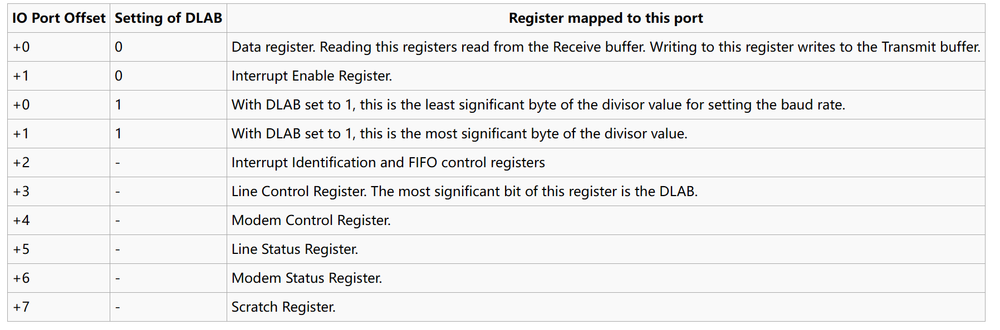
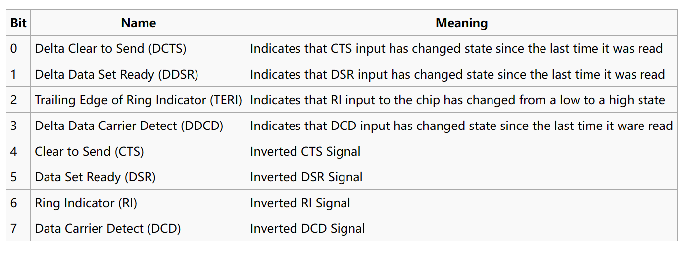
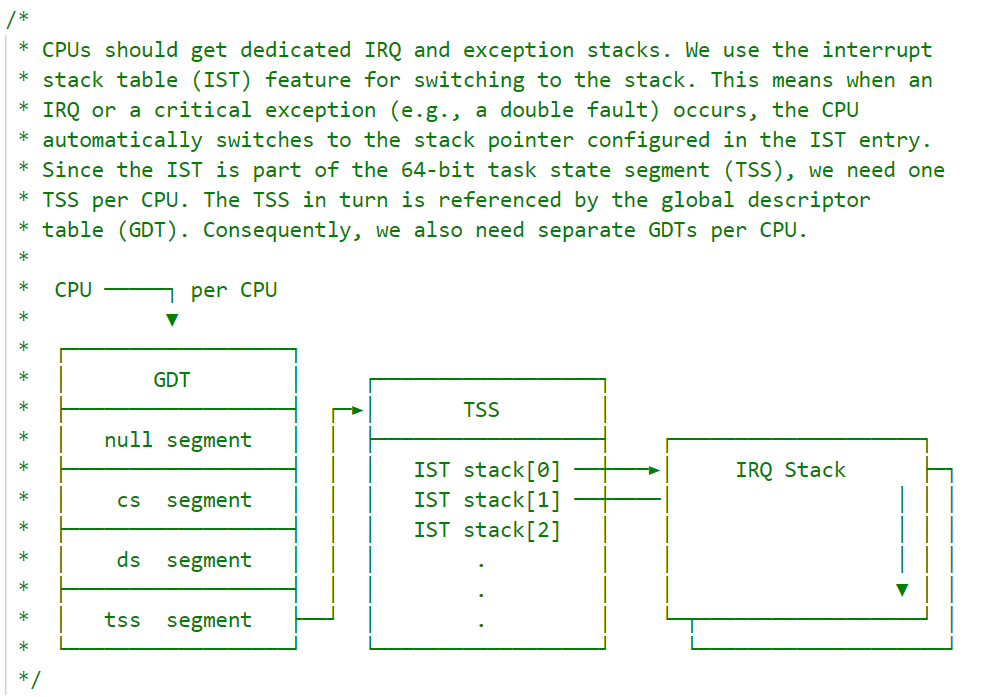
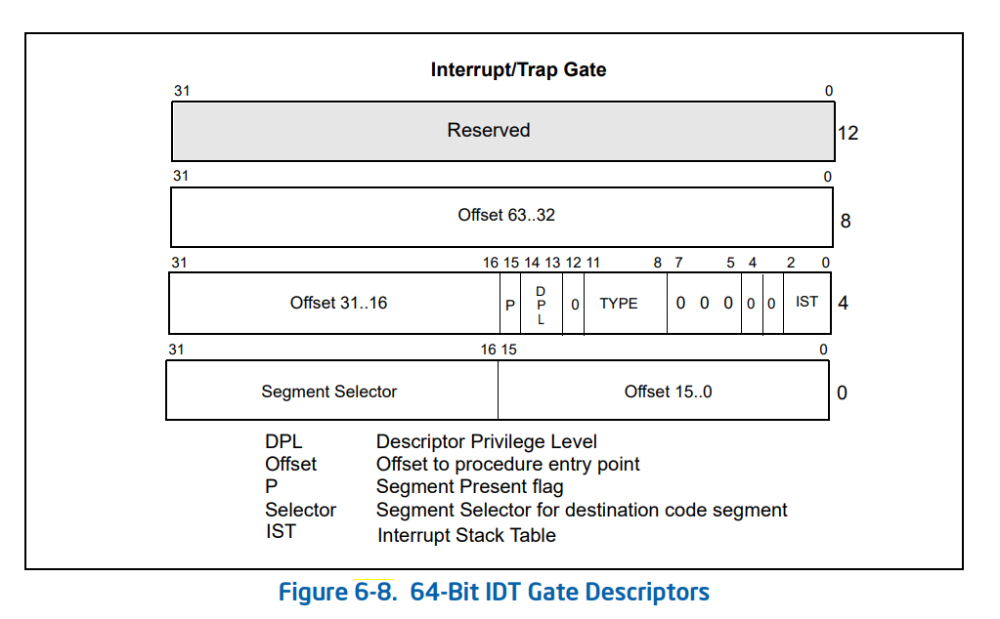
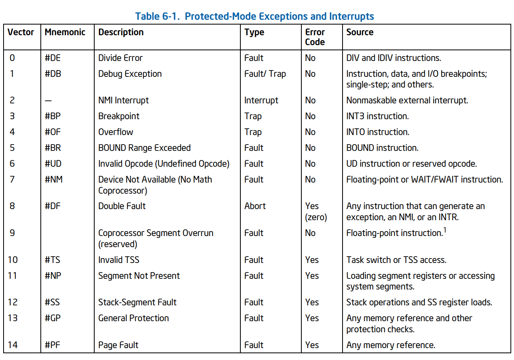

# Unikraft启动代码解析——C语言部分（part2）

## _ukplat_entry(setup.c)

_ukplat_entr这个函数用于体系结构相关的初始化。

### 初始化终端

`void _libkvmplat_init_console(void)`函数根据配置初始化VGA或者串行端口用于终端输出。

#### 串行端口

qemu指定`-nographic`选项会使用串行端口。

[串行端口](https://en.wikipedia.org/wiki/Serial_port)是一个串行通信接口，信息按顺序一个比特一个比特地传入或传出。在PC发展史的大部分时间里，数据都是通过串行端口传输到调制解调器、终端、各种外围设备等设备，以及直接在电脑之间传输的。现代计算机使用传输速度更快的标准，例如USB取代串行端口，不过，串行端口仍经常用于要求简单、低速接口的应用中。服务器可使用串行端口作为控制台进行诊断，而网络硬件（如路由器和交换机）通常使用串行控制台端口进行配置、诊断和紧急维护访问。

> 串行端口的编程参考[这里](https://wiki.osdev.org/Serial_Ports#Line_Protocol)

串行端口的端口地址有多个，可以在bios数据中找到，unikraft直接使用了0x3f8处的端口地址，然后各个I/O端口可以由“端口地址+offset”索引。串行端口的各个I/O端口如下：



在代码中定义:

```C
#define COM1 0x3f8

#define COM1_DATA (COM1 + 0)
#define COM1_INTR (COM1 + 1)
#define COM1_CTRL (COM1 + 3)
#define COM1_STATUS (COM1 + 5)

/* only when DLAB is set */
#define COM1_DIV_LO (COM1 + 0)
#define COM1_DIV_HI (COM1 + 1)
```

串行端口的初始化比较简单，首先关中断（将Interrupt Enable Register的值设为0），然后设置波特率（端口传输的速度），大小为时钟频率除以x，x为我们需要设置的参数，大小为两个字节，低字节放置于 offset + 0 的 I/O 端口 `COM1_DIV_LO`，高字节放置于 offset + 1 的 I/O 端口 `COM1_DIV_HI`。此处设置波特率的过步骤为：

1. 先将Line Control Register(`COM1_CTRL`)的最高位置为1，启用DLAB
2. 将x的高低字节写入到相应的位置
3. 清除Line Control Register的最高位，同时向Line Control Register写入3表示将传输字符的长度设置为8位。

> 关于串行端口各个寄存器及其位的作用，参考[这里](https://www.sci.muni.cz/docs/pc/serport.txt)

```C
void _libkvmplat_init_serial_console(void)
{
	outb(COM1_INTR, 0x00);  /* Disable all interrupts */
	outb(COM1_CTRL, DLAB);  /* Enable DLAB (set baudrate divisor) */
	outb(COM1_DIV_LO, COM1_BAUDDIV_LO);/* Div (lo byte) */
	outb(COM1_DIV_HI, COM1_BAUDDIV_HI);/*     (hi byte) */
	outb(COM1_CTRL, PROT);  /* Set 8N1, clear DLAB */
}
```

使用串行端口读写数据前，先要检查Line Status Register(LSR)，看数据是否就绪或者是否可以发送发送，然后使用"in"以及"out"从数据寄存器(`COM1_DATA`)读写数据。

> LSR 是一个8位的寄存器，其各个位的作用如下：



```C
#define COM1_STATUS (COM1 + 5)

static int serial_tx_empty(void)
{
	return inb(COM1_STATUS) & 0x20; // 检查LSR第6位Clear to Send
}

static void serial_write(char a)
{
	while (!serial_tx_empty())
		;

	outb(COM1_DATA, a);
}

void _libkvmplat_serial_putc(char a)
{
	if (a == '\n')
		serial_write('\r');
	serial_write(a);
}

static int serial_rx_ready(void)
{
	return inb(COM1_STATUS) & 0x01; // 检查LSR第1位Data Set Ready
}

int _libkvmplat_serial_getc(void)
{
	if (!serial_rx_ready())
		return -1;
	return (int) inb(COM1_DATA);
}
```

#### VGA

qemu指定`-device VGA`选项会使用VGA作为显示设备（由于helloworld运行完后显示窗口消失，所以会闪过，并不会打印到终端）。

> 关于VGA和显示设备在qemu中的使用参考[这里](https://www.kraxel.org/blog/2019/09/display-devices-in-qemu/)

假如指定了VGA设备，在bios初始化之后，一般会设置为80x25的[VGA字符模式](https://en.wikipedia.org/wiki/VGA_text_mode)。VGA的显存在[RAM Enable](http://www.osdever.net/FreeVGA/vga/extreg.htm#3CCR3C2W)启用时映射到内存区域的A0000h到BFFFFh的128k的部分，unikraft直接修改起始地址为[0b8000H](https://www.zhihu.com/question/269649445)的显存数据输出显示字符。由于VGA比串行端口复杂得多，以下只对unikraft的VGA初始化、字符输出进行分析。如果想深入了解VGA，参考额外的资料：[FreeVGA](http://www.osdever.net/FreeVGA/home.htm)(推荐), [Tutorial on VGA Graphics](http://web.archive.org/web/20140218012818/http://atschool.eduweb.co.uk/camdean/pupils/amac/vga.htm)。

VGA寄存器主要分为6类：

- [Graphics Registers](http://www.osdever.net/FreeVGA/vga/graphreg.htm) -- control the way the CPU accesses video RAM.
- [Sequencer Registers](http://www.osdever.net/FreeVGA/vga/seqreg.htm) -- control how video data is sent to the DAC.
- [Attribute Controller Registers](http://www.osdever.net/FreeVGA/vga/attrreg.htm) -- selects the 16 color and 64 color palettes used for EGA/CGA compatibility.
- [CRT Controller Registers](http://www.osdever.net/FreeVGA/vga/crtcreg.htm) -- control how the video is output to the display.
- [Color Registers](http://www.osdever.net/FreeVGA/vga/colorreg.htm) -- selects the 256 color palette from the maximum possible colors.
- [External Registers](http://www.osdever.net/FreeVGA/vga/extreg.htm) -- miscellaneous registers used to control video operation.

这里主要关注用于控制视频输入的CRT控制寄存器，要想访问它们，需要向CRTC地址寄存器（CRTC Address Register）写入寄存器索引，通过CRTC数据寄存器寄存器（CRTC Data Register）读写内容。[Input/Output Address Select](http://www.osdever.net/FreeVGA/vga/extreg.htm#3CCR3C2W)字段（地址0x3cc）指定CRTC地址寄存器和CRTC数据寄存器寄存器的位置在3B4h-3B5h或3D4h-3D5h。

函数`_libkvmplat_init_vga_console`用于VGA的初始化工作，主要是设置光标的初始位置以及清屏。

> 关于VGA字符模式下的编程，参考[OSdev：Printing To Screen](https://wiki.osdev.org/Printing_to_Screen)和[VGA Text Mode Operation](http://www.osdever.net/FreeVGA/vga/vgatext.htm)

```C
#define TAB_ALIGNMENT 8
#define VGA_WIDTH     80
#define VGA_HEIGHT    25
#define VGA_FB_BASE   0xb8000

static size_t terminal_row;
static size_t terminal_column;
static uint8_t terminal_color;
static uint16_t *const terminal_buffer = (uint16_t *)VGA_FB_BASE;
static uint16_t areg;   /* VGA address register */
static uint16_t dreg;   /* VGA data register */

void _libkvmplat_init_vga_console(void)
{
	unsigned long irq_flags;

	terminal_row = 0;	// 当前光标的行
	terminal_column = 0;	// 当前光标的列
	terminal_color = vga_entry_color(VGA_COLOR_LIGHT_GREY, VGA_COLOR_BLACK);	// 终端颜色

	local_irq_save(irq_flags);	// 保存之前的终端标志位(IF)到全局变量irq_flags并关中断
	/* Location of the address and data registers is variable and denoted
	 * by the least significant bit in the Input/Output register located
	 * at 0x3cc. For our emulated color display, they should always be
	 * 0x3d{4,5}, but better safe than sorry, so let's check at init time.
	 */
	if (inb(0x3cc) & 0x1) {
		areg = 0x3d4;
		dreg = 0x3d5;
	} else {
		areg = 0x3b4;
		dreg = 0x3b5;
	}

	/* Initialize cursor appearance. Setting CURSOR_START (0x0a) to 0x0e
	 * and CURSOR_END (0x0b) to 0x0f enables the cursor and produces
	 * a blinking underscore.
	 */
	outb(areg, 0x0a);
	outb(dreg, 0x0e);
	outb(areg, 0x0b);
	outb(dreg, 0x0f);
	local_irq_restore(irq_flags);	// 根据之前保存irq_flags开启或者关闭中断

	clear_terminal();
}
```
其中更改光标位置需要保存IF并关中断，然后再恢复，这通过宏local_irq_save/local_irq_restore来完成，将local_irq_save/local_irq_restore展开，可以发现，local_irq_save的功能是将IF的值保存在变量irq_flags中，local_irq_restore恢复IF：

```C
// local_irq_save(irq_flags)
do {
    do {
        unsigned long __f;
        // pushf指令将状态寄存器eflags压栈，然后pop指令将eflags的值写入到变量 __f 中
        asm volatile("pushf" "q" " ; pop" "q" " %0" : "=g"(__f)); 
        // irq_flags保存了中断标志位IF的值
        irq_flags = (__f & (1 << 9)) ? 1 : 0;
    } while (0);
    ({ asm volatile("cli" : : : "memory"); });
} while (0);

// local_irq_restore(irq_flags)
do { if (irq_flags) ({ asm volatile("sti" : : : "memory"); }); else ({ asm volatile("cli" : : : "memory"); }); } while (0)
```

显示一个字符的关键函数为`terminal_putentryat`，它由行列号x和y计算出字符在显存的位置index，然后将其写入到显存相应的位置，写入的数据为16位的char + color属性。

```C
static void terminal_putentryat(char c, uint8_t color, size_t x, size_t y)
{
	const size_t index = y * VGA_WIDTH + x;

	terminal_buffer[index] = vga_entry(c, color);
}

static inline uint16_t vga_entry(unsigned char uc, uint8_t color)
{
	return (uint16_t) uc | (uint16_t) color << 8;
}
```


##### 小结

- Unikraft可以配置串行端口和VGA两者显示终端，在qemu中分别指定`-nographic` 或 `-device VGA` 可以分别模拟两者情况。

- 串行端口的初始化需要设置波特率，读写操作前需要通过检查LSR相应的状态位，然后从相应的I/O端口读写数据
- VGA在BIOS完成后已经设置为80x25的字符的字符模式，初始化只需检查一下CRTC地址寄存器和CRTC数据寄存器寄存器的位置并设置索引并清屏。字符模式下VGA的显示，需要将行列位置信息转化为显存中对应的地址，然后写入数据即可。


#### 初始化中断向量表

函数 traps_table_init 用于初始化中断向量表。每个逻辑处理器（Logical CPU）都拥有自己全局描述符表(Global Descriptor Table, GDT)，GDT的每一个表项（段描述符）大小为8字节，在 IA-32e 模式下系统段描述符占用两个段描述符（16个字节）并兼容 IA-32 模式下的 8 字节段系统段描述符。这里的系统段描述符有三种：

- 调用门描述符（Call Gate Descriptor），调用门用于程序的控制权在不同特权级别之间的转换
- 中断向量表中的门描述符（IDT Gate Descriptor），包括任务门描述符、陷入门描述符和中断门描述符
- 局部段描述符表（LDT）和任务状态段描述符表（TSS）的描述符

> 为了提供不同权限级别代码段的访问控制，X86处理器提供了一组特殊的描述符，称为门描述符（Gate Descriptor）。门描述符有四种：  调用门（Call gate）、陷入门（Trap gate）、中断门（Trap gate） 、任务门（Task gate）

同时，在 IA-32e 模式下，CPU需要额外借助任务状态段（task status segment, TSS）中的中断栈表（interrupt stack table, IST）完成中断或者异常处理程序的栈切换。同样每个逻辑CPU都有一个GDT，GDT中又包含TSS段，TSS段中包含指向IST，IST的每一个表项指向一个相应的IRQ栈，其逻辑关系可以简化如下：



> 以下参考 Intel® 64 and IA-32 Architectures Software Developer Manuals vol3 6.14

在 IA-32e 模式下，IA32 模式的堆栈切换机制被修改。堆栈切换作为 64 位模式权限级别变更（由中断引起）的一部分时，不会加载新的 SS 描述符。IA-32e 模式只加载 TSS 的内层 RSP。新的 SS 选择器被强制为 NULL，SS 选择器的 RPL 字段被设置为新的 CPL。新 SS 设置为 NULL 是为了处理嵌套远跳转（Far CALL、INT、中断和异常）。旧的 SS 和 RSP 保存在新的堆栈中。在随后的 IRET 中，旧的 SS 将从堆栈中弹出并加载到 SS 寄存器中。

**在IST中提供了最多七个指向IRQ栈的指针。指针由中断描述符表（IDT）中的中断门描述符引用；参见图 6-8**。中断门描述符包含一个 3 位 IST 索引字段，该字段为 TSS 的 IST 部分提供了一个偏移量。处理器利用 IST 机制将 IST 指针指向的值加载到 栈指针RSP 中。



在 `workdir/unikraft/plat/kvm/x86/traps.c`文件中根据配置的逻辑CPU数目定义了 `cpu_gdt64` 和 `cpu_tss` 表用于存放每个逻辑CPU的GDT表和TSS信息，同时为每个CPU准备了了3个中断栈。

```c
__align(STACK_SIZE) /* IST1 */
char cpu_intr_stack[CONFIG_UKPLAT_LCPU_MAXCOUNT][STACK_SIZE];
__align(STACK_SIZE) /* IST2 */
char cpu_trap_stack[CONFIG_UKPLAT_LCPU_MAXCOUNT][STACK_SIZE];
__align(STACK_SIZE) /* IST3 */
char cpu_crit_stack[CONFIG_UKPLAT_LCPU_MAXCOUNT][STACK_SIZE];

static __align(8)
struct tss64 cpu_tss[CONFIG_UKPLAT_LCPU_MAXCOUNT];

static __align(8)
struct seg_desc32 cpu_gdt64[CONFIG_UKPLAT_LCPU_MAXCOUNT][GDT_NUM_ENTRIES];
```

> 注意结构体`seg_desc32`和结构体`seg_desc64`的区别，它们分别为32位和64位模式下的段描述符，但是大小都是16字节，不过`seg_desc32`后8个字节对应的成员为`raw`不使用。

处理器的中断源有两类：外中断(来自硬件，Interrupt) 和软件中断(异常或者陷入，Exception and Trap) 在 Intel® 64 and IA-32 Architectures Software Developer Manuals vol3 表6-1中定义了这些中断。其中第 0-22 是系统定义的，32-255是童用户定义的。(下图只列出了部分中断)



在 traps_table_init 函数中也对于系统定义的中断和用户定义的中断进行了区分。分别使用了 `FILL_TRAP_GAT` 和 `FILL_IRQ_GATE` 两个宏进行注册，而这两个宏的区别仅仅在于传给 `idt_fillgate` 函数的参数不同。`idt_fillgate` 将中断处理函数 fun 绑定到中断向量表 cpu_idt 的偏移量为 num 的 IDT Gate Descriptors上，并设置 ist、dpl 等属性。

```C
static struct seg_gate_desc64 cpu_idt[IDT_NUM_ENTRIES] __align(8);

static inline void idt_fillgate(unsigned int num, void *fun, unsigned int ist)
{
	struct seg_gate_desc64 *desc = &cpu_idt[num];

	/*
	 * All gates are interrupt gates, all handlers run with interrupts off.
	 */
	desc->offset_hi	= (__u64) fun >> 16;
	desc->offset_lo	= (__u64) fun & 0xffff;
	desc->selector	= IDT_DESC_OFFSET(IDT_DESC_CODE);
	desc->ist	= ist;
	desc->type	= IDT_DESC_TYPE_INTR;
	desc->dpl	= IDT_DESC_DPL_KERNEL;
	desc->p		= 1;
}
```

`FILL_TRAP_GAT` 宏接收一个标识 name 和 ist 号，它声明一个函数并调用 idt_fillgate 函数。

```C
#define FILL_TRAP_GATE(name, ist)					\
	extern void cpu_trap_##name(void);				\
	idt_fillgate(TRAP_##name, ASM_TRAP_SYM(name), ist)

// FILL_TRAP_GATE(divide_error,	2); 展开如下
extern void cpu_trap_divide_error(void); 
idt_fillgate(0, asm_trap_divide_error, 2)
```

这里 idt_fillgate 函数将 `asm_trap_divide_error` 函数绑定到偏移量为 0 的中断门描述符上。`asm_trap_divide_error` 函数并不能直接在代码中找到定义。由于 FILL_TRAP_GATE 宏中使用了 `ASM_TRAP_SYM` 宏构造中断处理函数的标识符，全局查找 `ASM_TRAP_SYM` 的使用场景或许可以找到 `asm_trap_divide_error` 函数声明的位置。

通过查找，可以在两个位置找到 `ASM_TRAP_SYM` 的使用

- `workdir/unikraft/plat/common/include/x86/traps.h` 文件中声明了各种中断处理函数"asm_trap_{name}"(假设这里的name字段表示中断的名称，例如divide_error、debug等)，中断向量号“TRAP\_{name}”，以及处理各个中断信号的函数“do\_{name}”。
- 而在 `workdir/unikraft/plat/kvm/x86/cpu_vectors_x86_64.S` 能定义了中断处理函数"asm_trap_{name}"的函数入口。

> 注意：用户自定的中断处理函数cpu_irq_{no}已经在FILL_IRQ_GATE宏中声明

"workdir/unikraft/plat/common/include/x86/traps.h" 文件中找到用于声明这些中断处理函数的宏，及其用于声明各个中断处理函数的语句。

```C
#define DECLARE_ASM_TRAP(trapname) \
	void ASM_TRAP_SYM(trapname)(void)

/*
 * These are assembler stubs in entry.S.
 * They are the actual entry points for virtual exceptions.
 */
DECLARE_ASM_TRAP(divide_error);
DECLARE_ASM_TRAP(debug);
DECLARE_ASM_TRAP(nmi);
DECLARE_ASM_TRAP(int3);
DECLARE_ASM_TRAP(overflow);
DECLARE_ASM_TRAP(bounds);
DECLARE_ASM_TRAP(invalid_op);
DECLARE_ASM_TRAP(no_device);
DECLARE_ASM_TRAP(double_fault);
DECLARE_ASM_TRAP(invalid_tss);
DECLARE_ASM_TRAP(no_segment);
DECLARE_ASM_TRAP(stack_error);
DECLARE_ASM_TRAP(gp_fault);
DECLARE_ASM_TRAP(page_fault);
DECLARE_ASM_TRAP(coproc_error);
DECLARE_ASM_TRAP(alignment_check);
DECLARE_ASM_TRAP(machine_check);
DECLARE_ASM_TRAP(simd_error);
DECLARE_ASM_TRAP(virt_error);
DECLARE_ASM_TRAP(security_error);
```

除此之外，在 "workdir/unikraft/plat/kvm/x86/cpu_vectors_x86_64.S" 中能找到用于定义中断处理函数的宏 `TRAP_ENTRY` 以及 `IRQ_ENTRY`

```C
.macro TRAP_ENTRY trapname, has_ec
ENTRY(ASM_TRAP_SYM(\trapname))
	.cfi_startproc simple
	.cfi_signal_frame
	.cfi_def_cfa rsp, 0
.if \has_ec
	/* Error code is pushed on the stack after the return address */
	.cfi_def_cfa_offset 16
.else
	/* There is only the return address on the stack */
	.cfi_def_cfa_offset 8
.endif
	.cfi_offset rip, -8
	/* Description of the stack with active IST */
	.cfi_offset cs, 0

#ifdef __clang__
	.cfi_offset flags, 8
#elif __GNUC__
	.cfi_offset rflags, 8
#else
#error "Unsupported Compiler"
#endif

	.cfi_offset rsp, 16
	.cfi_offset ss, 24
	cld

.if !\has_ec
	pushq_cfi $0                        /* no error code, pass 0 */
.endif
	PUSH_CALLER_SAVE
	subq $__REGS_PAD_SIZE, %rsp         /* we have some padding */
	.cfi_adjust_cfa_offset __REGS_PAD_SIZE

	movq %rsp, %rdi
	movq __REGS_OFFSETOF_ORIG_RAX(%rsp), %rsi
	call do_\trapname

	addq $__REGS_PAD_SIZE, %rsp         /* we have some padding */
	.cfi_adjust_cfa_offset -__REGS_PAD_SIZE
	POP_CALLER_SAVE
	addq $8, %rsp                       /* discard error code */
	.cfi_adjust_cfa_offset -8

	iretq
	.cfi_endproc
.endm
```

`TRAP_ENTRY` 首先调用了 PUSH_CALLER_SAVE 用于保存寄存器，然后通过 “call do\_\\trapname” 调用 traps.h 中的中断处理函数， 最后恢复寄存器。文件 "workdir/unikraft/plat/common/include/x86/traps.h" 中的 `DECLARE_TRAP` 宏声明了 TRAP_ENTRY 中内置的 “call do_\trapname” 函数。

```c
#define DECLARE_TRAP(name, str, event)					\
void do_##name(struct __regs *regs)					\
{									\
	int rc;								\
	rc = _raise_event_##event(TRAP_##name, regs, 0);		\
	if (unlikely(rc < 0))						\
		uk_pr_crit("trap handler returned error: %d\n", rc);	\
									\
	if (!rc)							\
		do_unhandled_trap(TRAP_##name, str, regs, 0);		\
}
```

Unikraft 通过定义一些事件（even）处理中断信号，通过 “\_raise\_event_{event}” 将中断信号 "name" 和特定的 "event" 绑定起来，trap.h 中的 `DECLARE_TRAP_EVENT(event)` 宏用于声明特定事件，它通过定义 `_raise_event_{even}` 函数，它准备一个陷入上下文 `ukarch_trap_ctx`—一个由指向栈上保存的寄存器的指针、中断向量号、错误码和错误地址组成的结构体，传入并执行 "event.h" 中宏 `uk_raise_event(event, data)`。

`uk_raise_event(event, data)`获取指向 even 的处理函数表的指针并跳转到函数`uk_raise_event_ptr`，最后在它的函数体中轮询并调用 even 的处理函数表中的事件处理函数。

调用过程简述如下：

```text
| // In traps.h
|
|--> void do_##name(struct __regs *regs)
|	 由中断信号转向发起相应的事件
|
|--> static inline int _raise_event_##event(int trapnr, struct __regs *regs,	unsigned long error_code)
|	 准备号中断上下文作为参数
|
| // In event.h
|
|--> uk_raise_event(event, data)
| 	 获取指向实现处理函数表的指针
|
|--> static inline int uk_raise_event_ptr(struct uk_event *e, void *data)
|	 轮询函数表，执行事件处理函数
|
```


```C
// workdir/unikraft/plat/common/include/x86/traps.h
#define DECLARE_TRAP_EVENT(event)					\
UK_EVENT(event);							\
static inline int _raise_event_##event(int trapnr, struct __regs *regs,	\
		unsigned long error_code) {				\
	struct ukarch_trap_ctx ctx = {regs, trapnr, error_code, 0};	\
	return uk_raise_event(event, &ctx);				\
}

#define _raise_event_NULL(...) (0)

#define DECLARE_TRAP(name, str, event)					\
void do_##name(struct __regs *regs)					\
{									\
	int rc;								\
	rc = _raise_event_##event(TRAP_##name, regs, 0);		\
	if (unlikely(rc < 0))						\
		uk_pr_crit("trap handler returned error: %d\n", rc);	\
									\
	if (!rc)							\
		do_unhandled_trap(TRAP_##name, str, regs, 0);		\
}

// workdir/unikraft/include/uk/event.h
/**
 * Helper macro to raise an event by name. Invokes the handler chain until the
 * first handler successfully handled the event.
 *
 * @param event
 *   Name of the event to raise.
 * @param data
 *   Optional data supplied to the event handlers
 * @return
 *   One of the UK_EVENT_* macros on success, errno on < 0
 */
#define uk_raise_event(event, data)					\
	({	_UK_EVT_IMPORT_EVENT(event);				\
		uk_raise_event_ptr(UK_EVENT_PTR(event), data);	})

/**
 * Raise an event by pointer and invoke the handler chain until the first
 * handler successfully handled the event or returned a negative error code.
 *
 * @param e
 *   Pointer to the event to raise.
 * @param data
 *   Optional data supplied to the event handlers
 * @returns
 *   A negative error value if a handler returns one. Event processing
 *   immediately stops in this case. Otherwise:
 *   - UK_EVENT_HANDLED if a handler indicated that it successfully handled
 *     the event and event processing should stop with this handler.
 *   - UK_EVENT_HANDLED_CONT if at least one handler indicated that it
 *     successfully handled the event but event handling can continue, and no
 *     other handler returned UK_EVENT_HANDLED.
 *   - UK_EVENT_NOT_HANDLED if no handler handled the event.
 */
static inline int uk_raise_event_ptr(struct uk_event *e, void *data)
{
	const uk_event_handler_t *itr;
	int rc;
	int ret = UK_EVENT_NOT_HANDLED;

	uk_event_handler_foreach(itr, e) {
		__uk_event_assert(*itr);
		rc = ((*itr)(data));
		if (unlikely(rc < 0))
			return rc;

		if (rc == UK_EVENT_HANDLED)
			return UK_EVENT_HANDLED; // 处理完成返回

		if (rc == UK_EVENT_HANDLED_CONT)
			ret = UK_EVENT_HANDLED_CONT; // 没有处理完成，下一个
	}

	return ret;
}
```

event.h 中还提供了注册事件的宏 `UK_EVENT(name)`，它在声明中断事件被`DECLARE_TRAP_EVENT(event)`宏使用，向“.uk_eventtab” section中加入像“.uk_event\_{event}~{prio}” 的符号，这些符号在链接时会由编译器自动排序（ 生成的link64.ld中指定了.uk\_eventtab : { KEEP(\*(SORT\_BY\_NAME(.uk\_event\_\*))) ），例如：".uk_event_trap_invalid_op~"是事件trap_invalid_op的处理函数表的头部，".uk_event_trap_invalid_op~~"是表的尾部，中间的符号".uk_event_trap_invalid_op~{prio}"是由宏 `UK_EVENT_HANDLER_PRIO(event, fn, prio)` 注册的事件处理函数，其中 prio 指定了注册的函数 fn 的优先级。在`uk_raise_event_ptr`函数中，从“.uk_event\_{event}~”的的下一个符号开始调用“.uk_event\_{event}~{prio}” 指向的函数，直到中断结果提前返回或者遇到“.uk_event\_{event}\~\~”为止。

```c
/**
 * Register an event. If the event should be raised from different libraries
 * export its symbol as 'uk_event_name'.
 *
 * @param name
 *   Name of the event. The name may contain any characters that can be used
 *   in C identifiers.
 */
#define UK_EVENT(name)							\
	_UK_EVT_SECTION_HEADER(name);					\
	_UK_EVT_SECTION_HLIST_END(name)

#define _UK_EVT_SECTION_HLIST_END(event)				\
	_UK_EVT_SECTION_LABEL(#event "~~", _UK_EVT_HLIST_END(event))

#define _UK_EVT_SECTION_HEADER(event)					\
	extern const uk_event_handler_t _UK_EVT_HLIST_END(event)[];	\
	struct uk_event							\
	__used __section(".uk_event_" #event "~")			\
	_UK_EVT_EVENT(event) = {					\
		_UK_EVT_HLIST_END(event)				\
	}

// 以DECLARE_TRAP_EVENT(trap_invalid_op)展开如下

extern const uk_event_handler_t _uk_event_trap_invalid_op_end[]; 

struct uk_event __attribute__((used)) __attribute__((section(".uk_event_" "trap_invalid_op" "~"))) uk_event_trap_invalid_op = { _uk_event_trap_invalid_op_end };

__asm__ ( ".pushsection \".uk_event_" "trap_invalid_op" "~~" "\", \"a\"\n" "_uk_event_trap_invalid_op_end" ":\n" ".popsection\n" ); 

static inline int _raise_event_UKARCH_TRAP_INVALID_OP(int trapnr, struct __regs *regs, unsigned long error_code) 
{ struct ukarch_trap_ctx ctx = {regs, trapnr, error_code, 0}; return ({ extern struct uk_event uk_event_trap_invalid_op; uk_raise_event_ptr((&DECLARE_TRAP_EVENTuk_event_trap_invalid_op), &ctx); }); }


// UK_EVENT_HANDLER_PRIO(UKARCH_TRAP_PAGE_FAULT, vmem_arch_pagefault,CONFIG_LIBUKVMEM_PAGEFAULT_HANDLER_PRIO); 展开如下

static const uk_event_handler_t __attribute__((used)) __attribute__((section(".uk_event_" "trap_page_fault" "~" "CONFIG_LIBUKVMEM_PAGEFAULT_HANDLER_PRIO"))) _uk_event_trap_page_fault_CONFIG_LIBUKVMEM_PAGEFAULT_HANDLER_PRIO_vmem_arch_pagefault = (vmem_arch_pagefault)
```


最后回到文件 trap.c 中用于初始化中断向量表的函数 traps_table_init，它使用 `FILL_TRAP_GATE(name, ist)` 宏注册了表6-1中的offset从0到20的系统异常的处理函数到中断向量表中，然后使用 `FILL_IRQ_GATE(num, ist)` 宏将 offset 为32到255的用户异常的处理函数到IDT表相应的位置。最后设置的IDT表指针的base和limit。

```c
idtptr.limit = sizeof(cpu_idt) - 1;
idtptr.base = (__u64) &cpu_idt;
```

对于GDT、IDT和TSS的初始化在setup.c中的函数 traps_lcpu_init 实现：

```c
void traps_lcpu_init(struct lcpu *this_lcpu)
{
	gdt_init(this_lcpu->idx);
	tss_init(this_lcpu->idx);
	idt_init();
}
```

gdt_init 函数使用 [lgdt]([LGDT/LIDT — Load Global/Interrupt Descriptor Table Register (felixcloutier.com)](https://www.felixcloutier.com/x86/lgdt:lidt)) 指令重新加载指向gdt表的指针 “gdtptr”到GDTR，“gdtptr”的base为 `cpu_gdt64[idx]` 的首元素地址（这里与 之前lcpu_start.S中加载的gdt表位置不一样）。然后向栈中压入段选择器（指向GDT表的offset为1的项，是代码段描述符）和`jump_to_new_cs`的相对地址，然后使用 “lretq” 指令跳转到 `jump_to_new_cs` ，在这里，将ES、SS和DS段寄存器的存放的段选择器指向数据段，FS和GS段寄存器的值置为0。

```c
static void gdt_init(__lcpuidx idx)
{
	volatile struct desc_table_ptr64 gdtptr; /* needs to be volatile so
						  * setting its values is not
						  * optimized out
						  */

	cpu_gdt64[idx][GDT_DESC_CODE].raw = GDT_DESC_CODE64_VAL;
	cpu_gdt64[idx][GDT_DESC_DATA].raw = GDT_DESC_DATA64_VAL;

	gdtptr.limit = sizeof(cpu_gdt64[idx]) - 1;
	gdtptr.base = (__u64) &cpu_gdt64[idx];

	__asm__ goto(
		/* Load the global descriptor table */
		"lgdt	%0\n"

		/* Perform a far return to enable the new CS */
		"leaq	%l[jump_to_new_cs](%%rip), %%rax\n"

		"pushq	%1\n"
		"pushq	%%rax\n"
		"lretq\n"
		:
		: "m"(gdtptr),
		  "i"(GDT_DESC_OFFSET(GDT_DESC_CODE))
		: "rax", "memory" : jump_to_new_cs);
jump_to_new_cs:

	__asm__ __volatile__(
		/* Update remaining segment registers */
		"movl	%0, %%es\n"
		"movl	%0, %%ss\n"
		"movl	%0, %%ds\n"

		/* Initialize fs and gs to 0 */
		"movl	%1, %%fs\n"
		"movl	%1, %%gs\n"
		:
		: "r"(GDT_DESC_OFFSET(GDT_DESC_DATA)),
		  "r"(0));
}
```


>  上述代码，如果对于加载和跳转到 `jump_to_new_cs` 的内联汇编不理解，可以参考一下[copilot的分析](gpt_answers/gdt_init.txt)

对于 tss_init 函数，它构造了一个指向cpu_tss[idx]的GDT描述符，写入到GDT表索引为3的位置，然后使用 [ltr](https://www.felixcloutier.com/x86/ltr) 指令加载TSS到task register。

对于 idt_init 函数，它使用 "lidt" 指令加载 idtptr 到IDTR完成了对中断向量表的初始化。


##### 小结

- 在IDT表的初始化中，通过 `FILL_TRAP_GATE(name, ist)` 和 `FILL_IRQ_GATE(num, ist)` 两个宏向IDT填充对应的表项（gate descriptor）。
- 对于系统中断处理函数的声明使用"workdir/unikraft/plat/common/include/x86/traps.h"中的`DECLARE_ASM_TRAP(trapname)`宏，定义中断处理函数使用“cpu_vectors_x86_64.S” 文件中的`TRAP_ENTRY`或者 `IRQ_ENTRY` 宏。
- 对于中断，unikraft并不是为每一个中断单独安排一个中断处理函数，而是接收到中断后通过`_raise_event_##event`函数发出一个事件（event），中断信号和事件的关系可以是多对一的，这样简化了中断处理。
- Unikraft内部通过`uk_raise_event(event, data)`宏声明事件，通过`UK_EVENT_HANDLER_PRIO(event, fn, prio)`宏注册事件的处理函数。每个事件在".uk\_eventtab" section中保存了一张用于处理该事件的函数表，以符号“.uk_event\_{event}~”为表头（event为事件名称），并以符号“.uk_event\_{event}~~”为表头为结束标志，中间的“.uk_event\_{event}~{prio}”的值为事件"event"优先级为"prio"的处理函数。函数`uk_raise_event_ptr(struct uk_event *e, void *data)`轮询事件e的处理函数表并执行其中注册的事件处理函数。

### 后续更新中
